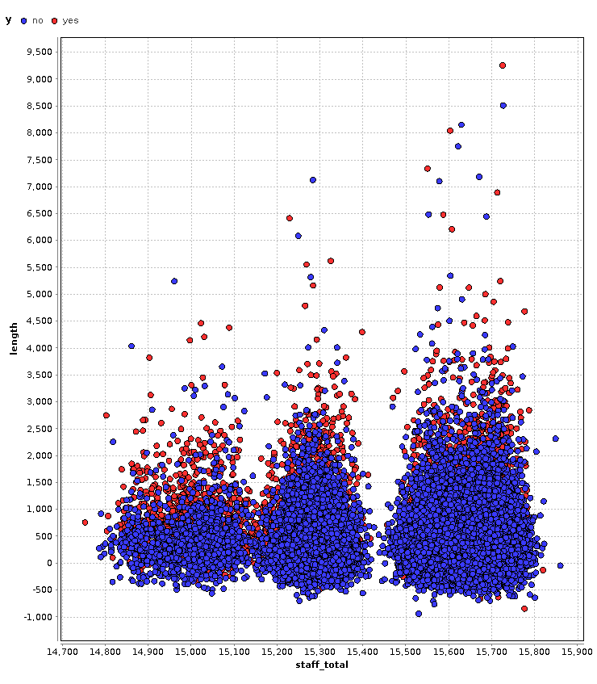

#Resultado 1

##¿Que deseo encontrar?

La relación entre los atributos: **staff_total**, **length**, **y**

Es decir, si el número de empleados al momento de realizarse la llamada y la duración de la llamada, influyen o determinan si se efectuará una venta durante esa llamada.

##Representación gráfica del hallazgo:

##Conclusión:

Para que se efectué una venta durante la llamada, no es necesario que la misma tenga una larga duración, es decir, el cliente llama con la decisión previa de realizar una compra.

En relación al número de empleados, éste no influye de gran manera en la realización de la venta, en concreto, pero si se puede inferir que una mayor cantindad de empleados atienden mayor cantidad de llamadas.
