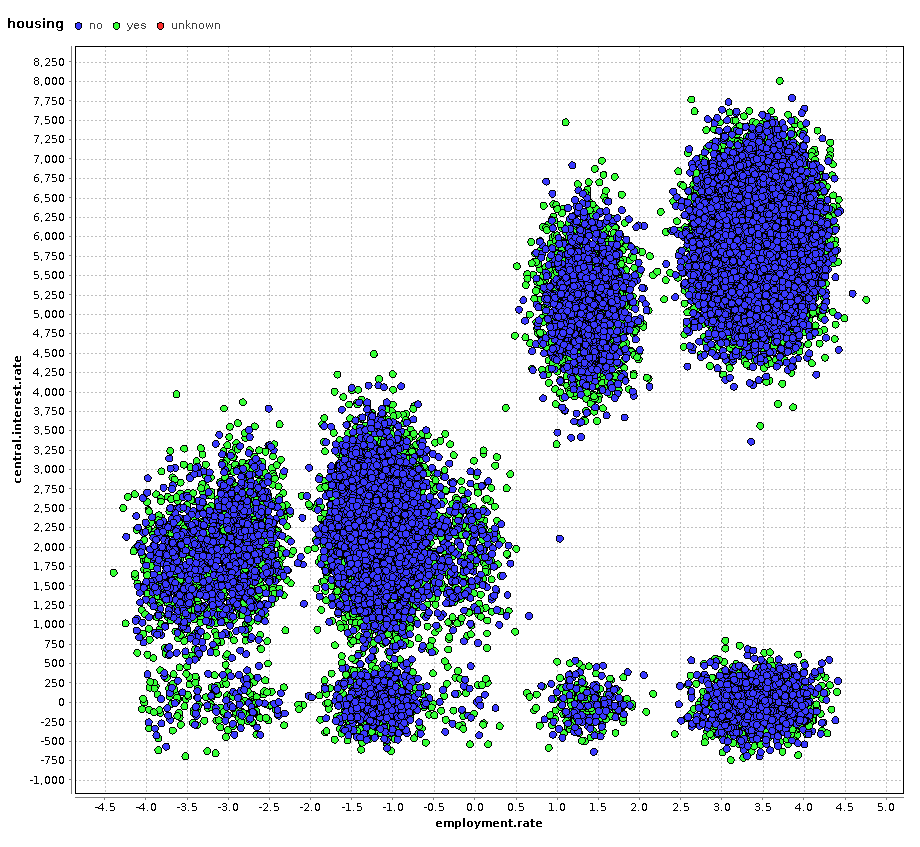

#Resultado 2

##¿Que deseo encontrar?

La relación entre los atributos: **central.interest.rate**, **employment.rate**, **housing**

Es decir, en que medida los índices nacionales de interés y empleo, llegan a determinar si un cliente cuenta o no con casa propia, considerando que el crédito bancario es una manera de tener una casa propia.

##Representación gráfica del hallazgo:

##Conclusión:

Mientras más bajo sea el índice nacional de interés, mayor es la cantidad de clientes que cuentan con casa propia, incluso a pesar de un índice bajo de empleo.

