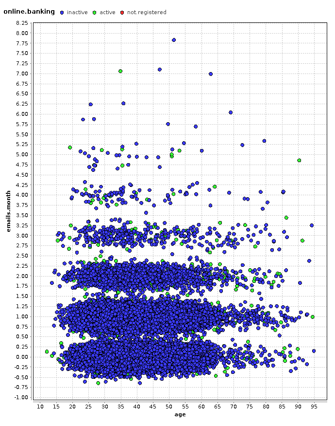

#Resultado 3

##¿Que deseo encontrar?

La relación entre los atributos: **emails.month**, **age**, **online.banking**

Es decir, si el uso de la Banca por internet esta determinada por la *edad del cliente* o el *número de emails* que la banca envíe a su cliente.

##Representación gráfica del hallazgo:

##Conclusión:

Se puede observar que una gran cantidad de clientes no utilizan la banca por internet.

También se infiere que ni la edad del cliente, ni la cantidad de emails enviados por el Banco, determinan o influyen el uso de la Banca por internet.
